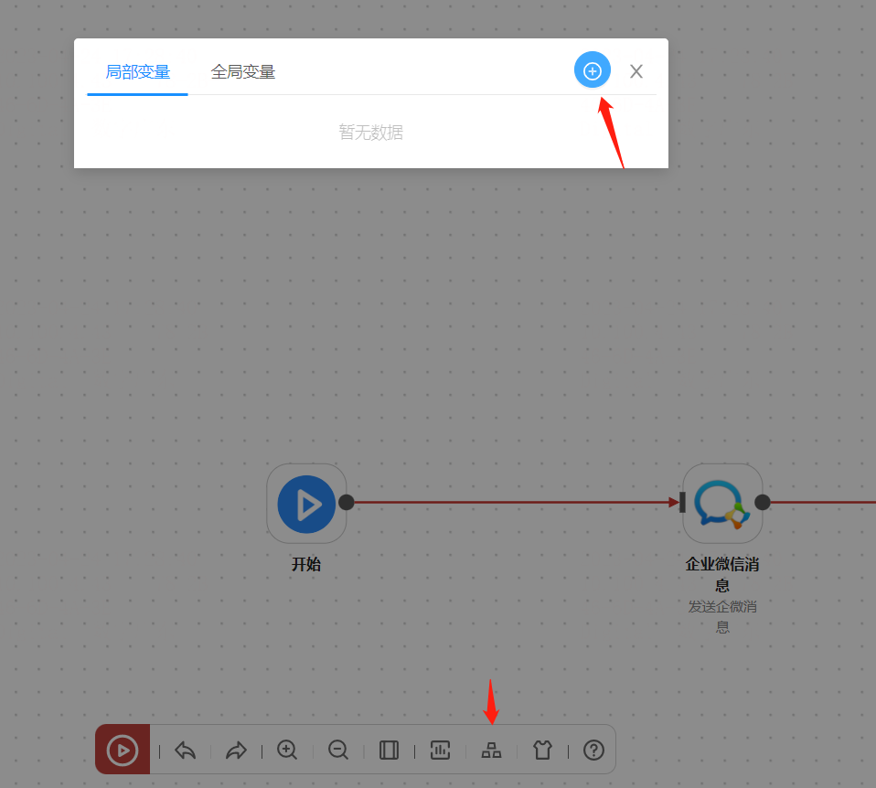

## W5 企业微信插件介绍

W5 企业微信插件是用于 [W5 SOAR](https://github.com/w5teams/w5) 平台的一款插件，可用于向企业微信发送 [webhook 消息](https://developer.work.weixin.qq.com/document/path/91770)。

## 配置方法

### 1、直接填写 webhook

### 2、使用剧本变量

